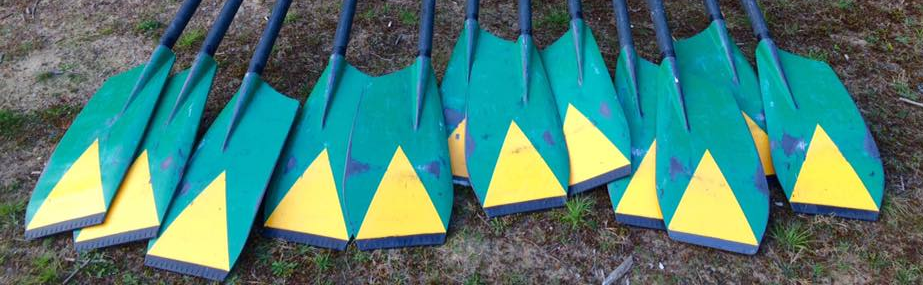
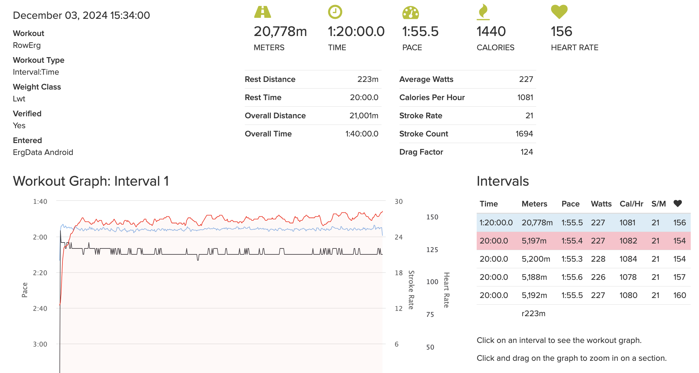
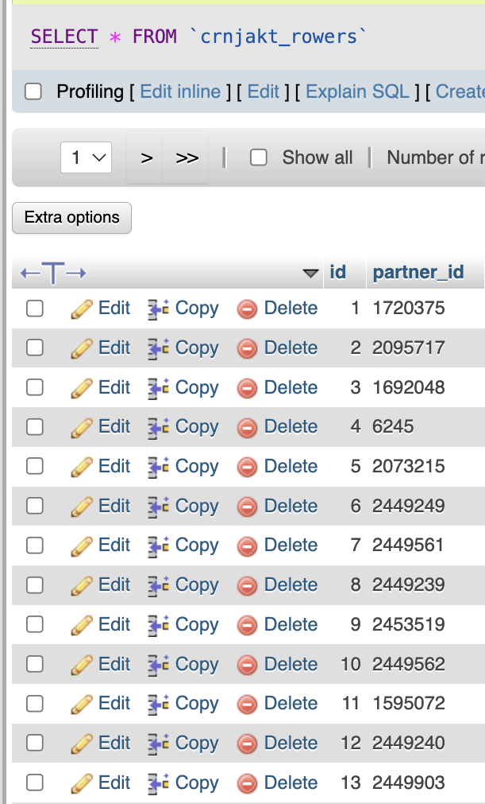
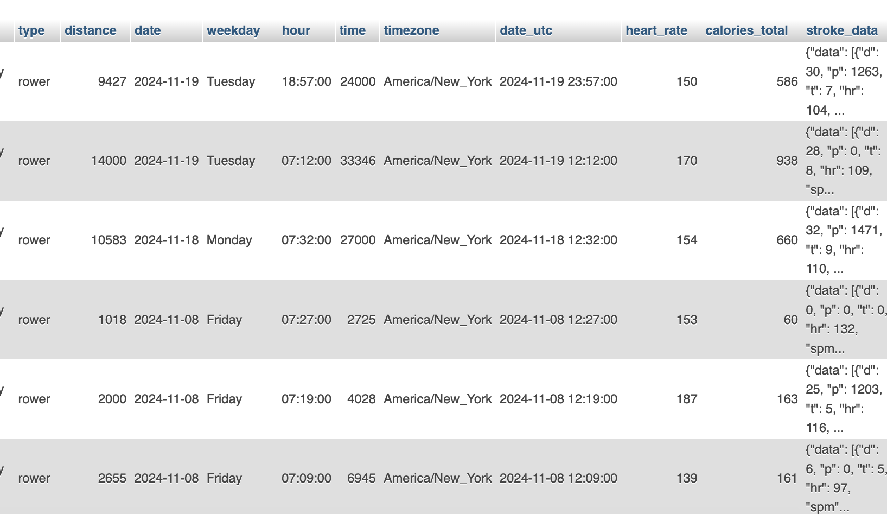
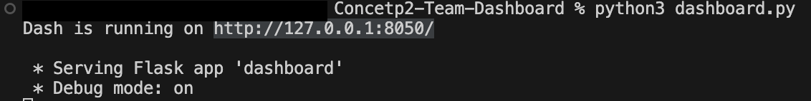
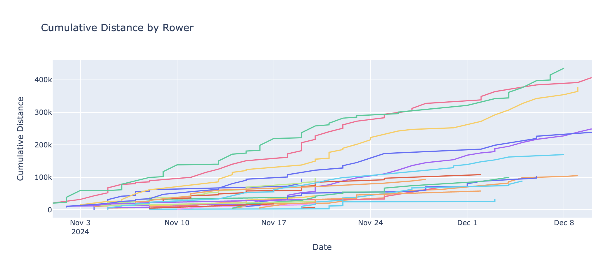
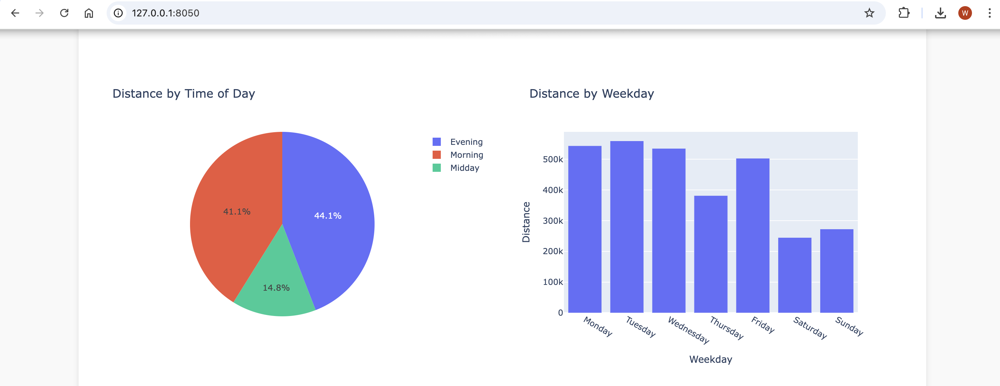
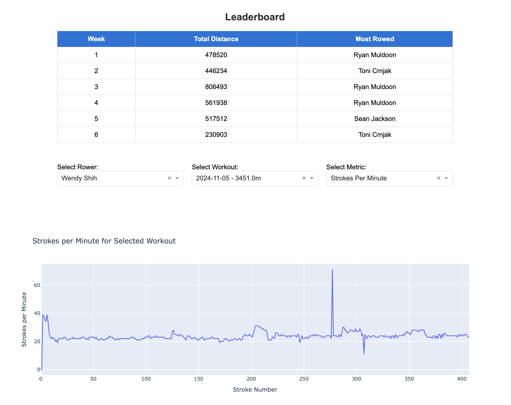

# Ergdata Dashboard

The Dashboard can be viewed here https://ergdata-dash.onrender.com/ 
Once started it takes 2 minutes to fully load up, as it is hosted by render, which will put it to sleep if it hasn't been accessed for more than 15 minutes.


As coaches, we want to know how our rowers perform in daily workouts through this winter season. The largest bulk of a successful winter training regimen is done on a Concept2 Rowing Machine, which measures distance colleted, speed achieved, and strokes taken per minute. Performance on a Concept2 is gold standard in rowing power output comparison. 


By using the API provided by the creators of Concept 2, we are able to gather and summerize individual data and construct a dashboard to track rowers’ progress and graph for better interpretation. When it comes to building lineups, this is a very transparent approach to building racing lineups that showcases individual effort. For rowers, this is highly motivating to catch up with leading members, so everyone can improve together during seasons. 

## Outline
1. Data resources
2. ETL process 
3. Dashboard showcase
4. Data analysis
5. Conclusion and feedback 


## 1. Data resources
To collect the data, we used Web Scraping Techniques as well as utilizing resources from Concept2 API. We use API and team data as following:
- https://log.concept2.com/developers/home
    - provdes necessary steps on setting up the API. The users need to register on a developer account and request a unique token through instructions featured here
- https://log.concept2.com/developers/documentation/  (API)
    - Once the API token is obtained, the Concept2 Documentation provides a summary of functions that user is allowed to run against the database
- https://log.concept2.com/team (Team record)
    - Once you are set up, to access the record of your team you need to Log into the Concept2 Logbook with your own credewntials, go to the "Team" page. All rowers must fulfill the following conditions:
        - Have joined the team
        - Have linked to the develper as a "training partner" to give specific permission to use their data

Repository link:
https://github.com/BROJ3/Concept2-Team-Dashboard  (our GitHub)


<!-- (add explanation of erg data and how we collect team records) -->



From the view website, we can see all information we need, including date, time, workout type, meters, pace and heart rate.

The [Concept2 Logbook API](https://log.concept2.com/developers/documentation/) documentation explains all details of how the website works, and the variable name, type, description, example and so on.


## 2. ETL process
Extraction comes from webscraping and the API, transformation comes selecting only what we need, splitting datetime into date and hour, and we are loading all that into the database. 
Also we kept only rowers and workouts table because it was getting complicated with 3 tables. Every workout now has a column with a big JSON for each workout.

Here we explain our scipts one by one and step by step:
### Main script 
- config example

All credential information that a 'team captain' user needs to obtain information is described in the config file  
```py
host='Your database host'
port='Your port number'
user='Your username'
passwd='Your password for the database'

db='database name'
access_token = 'access token for concept2 logbook API' 

login_payload = {
    "username": "Your Concetp2 Logbook Username",  
    "password": "Your Concetp2 Logbook Password"
    }

my_team='Your team number provided in the URL on the "MY TEAM" page'
```

The code does the following functions

- Tables Defined:
    - crnjakt_rowers: Stores unique partner_id and name of rowers.
    - crnjakt_workouts: Tracks workout details, and provides a backbone of thata to be manipulated. Has a foreign key linking to crnjakt_rowers.

- Data Insertion Functions:
    - insert_rower: Inserts a new rower (partner_id, name) into the crnjakt_rowers table.
    - insert_workout: Inserts a workout into crnjakt_workouts.Validates that the partner_id exists in crnjakt_rowers Includes workout details like type, distance, date, time, and stroke data.

- Fetching API Data:
    - Rowers Data Parsing: Uses BeautifulSoup to parse the HTML and extract rowers’ partner_id and name.
    - Accessing Workouts: For each rower, fetches their workouts via an API. Determines the latest workout date using get_latest_workout_date.
    - Processing Workouts: Iterates through each workout: Fetches additional stroke data if available. Inserts workout data into the database.
    - Handling Stroke Data: If stroke data is available, fetches it from another API endpoint and inserts it into the database.


The dashboard integrates Flask, Dash, Plotly, and a MySQL database to create an interactive web application for visualizing cumulative rowing distances over time for individual rowers.

- SQL Querie examples that give valuable data for rowing team analysis:

```sql
SELECT name, SUM(distance) AS total_distance, COUNT(DISTINCT date) AS active_days
FROM `your_database`
WHERE your_database.date BETWEEN '2024-11-18' AND '2024-11-26' AND type = 'rower'
GROUP BY name
ORDER BY total_distance DESC;

SELECT name, SUM(distance) as distance, COUNT(DISTINCT date) as days, COUNT(*) AS logs 
FROM `your_database` 
GROUP BY name 
ORDER BY distance DESC,days DESC,name;
```
These queries provide summaries of main metric in either a holistic view or filtered by the desired week

- Fetching and Processing Data:

    - Retrieves rows from the database using a cursor.
    - Processes the raw data into dictionaries containing name, distance, and date as keys for desired tasks.
    - Converts string dates to Python datetime objects for sorting and further processing.
    - Cumulative Distance Calculation: Tracks cumulative distances for each rower and creates a new list, cumulative_data, with cumulative distance values for each date.

- Visualization with Dash and Plotly: 
    - Plotly Documentation: https://plotly.com/python/
    - Dash Application: Creates a Dash web application (app), which uses Plotly for rendering graphs.
    - Plotly Figure: "dcc.Graph" displays a chart using plotly.express which can be further modified to be a histogram, line chart, pie chart, or more.
    - Layout: A single dcc.Graph element displays the chart within a Div.

- Interactive Visualization: Users can explore trends for each rower interactively.


## 3. Database and dashboard showcase
Below is our database screenshot:




When you run the script, make sure you have the config file well-set. 

Seeing this means the script work well. 

By executing "dashboard.py" script, the link of [Flask app](http://127.0.0.1:8050/) will show the dashboard on localhost server

An exmple dashboard:





## 4. Data Analysis
From our dashbord, we can observe how are the rowers performing during the season. 

When we execute the "visuals.py" script, the link of [Flask app](http://127.0.0.1:8050/) will show cumulative distances tracked for each rower, showing trends over time and highlighting their consistency or gaps in activity. The chart allows us to identify the most active rowers based on total distances, as well as periods of peak activity within the season. We can also observe the specific distribution of work done per week and per time of the day, identify most active users by weekl and plot individual workouts with variales of pace, strokes per minte, and heart rate. We can further observe single person's record across time by hover onto the lines.

 By analyzing the smoothed data, we can detect patterns such as steady progress, plateaus, or sudden spikes in performance, which may correlate with training schedules or events. This analysis provides valuable insights into overall team performance and individual contributions. 

The whole view can be observed here [View the PDF file](example_output.pdf)


## 5. Conclusion and feedback
For anyone to recreate this project using python, necessary techniques include algorithm use with dicitionaries, datetime manipulation and handling, web scraping, and API handling

In the future, if we can collect multiple seasons data, then we can compare rowers' performance by season, and plan different training strategies based on the result.


